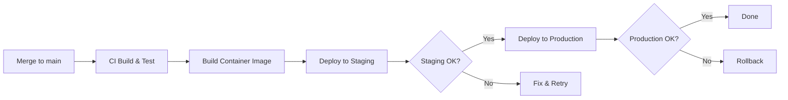

# Deployment

Deploying software is the most dangerous thing you do regularly. Every deployment is a controlled introduction of change into a system that was (presumably) working. The goal is to make deployments boring, reversible, and observable.

---

## 1. Pre-Deploy Checklist

Complete this checklist before every production deployment. Skip nothing for SEV-1 hotfixes — those are exactly the deployments where mistakes happen.

### Code Readiness
- [ ] All CI checks pass (tests, lint, type-check, build)
- [ ] Code has been reviewed and approved
- [ ] No unresolved review comments
- [ ] Feature flags are in place for risky changes
- [ ] Database migrations have been tested against a production-like dataset

### Environment Readiness
- [ ] Environment variables and secrets are configured
- [ ] Dependencies are locked (no floating versions)
- [ ] Config changes have been deployed before code changes
- [ ] Sufficient capacity for the deployment (no ongoing incidents, no traffic spikes)

### Operational Readiness
- [ ] Monitoring dashboards are open and baselined
- [ ] Alerting is configured for key metrics
- [ ] Rollback procedure is documented and tested
- [ ] The deploying engineer has access to production logs
- [ ] On-call engineer is aware of the deployment

### Timing
- [ ] Deploy during low-traffic hours when possible
- [ ] Do not deploy on Fridays (unless it's a hotfix)
- [ ] Do not deploy before holidays or long weekends
- [ ] Do not deploy during another active incident
- [ ] Do not deploy multiple unrelated changes at once

---

## 2. Staging to Production Flow

### The Deployment Pipeline

```
Feature Branch → PR Review → Merge to Main → CI Build → Staging Deploy
    → Staging Verification → Production Deploy → Production Verification
```



### Staging Verification

After deploying to staging, verify:

1. **Smoke tests pass.** Automated tests that hit critical endpoints.
2. **New feature works.** Manual verification of the specific changes.
3. **Existing features still work.** Quick manual check of core flows.
4. **Migrations ran successfully.** Check database state.
5. **No new errors in logs.** Review logs for unexpected errors.

```bash
# Run smoke tests against staging
API_URL=https://staging.example.com bun run test:smoke

# Check staging health
curl -s https://staging.example.com/health | jq .

# Check recent logs for errors
kubectl logs -l app=api --since=5m | grep -i error
```

### Production Deployment

```bash
# Tag the release
git tag v2.4.0
git push origin v2.4.0

# Deploy (varies by infrastructure)
# Option A: Container orchestration
kubectl set image deployment/api api=registry.example.com/api:v2.4.0

# Option B: Platform deploy
railway up --service api

# Option C: Direct deploy
bun run deploy:production
```

### Progressive Rollout (When Available)

For high-risk changes, roll out gradually:

1. **Canary (5% of traffic)** — Deploy to a single instance. Monitor for 15 minutes.
2. **Partial (25% of traffic)** — Expand to more instances. Monitor for 30 minutes.
3. **Full (100% of traffic)** — Complete the rollout. Monitor for 1 hour.

```bash
# Canary deployment with Kubernetes
kubectl set image deployment/api api=registry.example.com/api:v2.4.0
kubectl rollout pause deployment/api  # After first pod updates

# Check canary health
kubectl get pods -l app=api -o wide
# Monitor error rates in canary pod

# Continue rollout
kubectl rollout resume deployment/api
```

---

## 3. Rollback Procedure

### When to Rollback

Rollback immediately if you observe any of:
- Error rate increases above baseline (> 1% 5xx for most services)
- Latency increases significantly (P95 > 2x baseline)
- Key business metrics drop (orders, signups, etc.)
- Users report issues that weren't present before the deploy
- Database is in an inconsistent state

**Do not wait to understand the root cause before rolling back.** Rollback first, investigate later.

### How to Rollback

```bash
# Option 1: Revert the commit and redeploy
git revert HEAD --no-edit
git push origin main
# CI/CD will deploy the reverted code

# Option 2: Redeploy the previous version
kubectl rollout undo deployment/api
# or
kubectl set image deployment/api api=registry.example.com/api:v2.3.0

# Option 3: Platform rollback
railway rollback --service api
```

### Database Migration Rollbacks

Database rollbacks are the hardest part. Follow these rules:

1. **Every migration must have a corresponding down migration.**
2. **Test the down migration before deploying the up migration.**
3. **Never drop columns immediately.** Instead:
   - Deploy code that stops reading the column
   - Wait one release cycle
   - Drop the column in the next release

```typescript
// Migration: add_status_column
export async function up(db: Database) {
  await db.schema.alterTable('orders').addColumn('status', 'text', (col) =>
    col.defaultTo('pending').notNull()
  );
}

export async function down(db: Database) {
  await db.schema.alterTable('orders').dropColumn('status');
}
```

### Rollback Decision Tree

```
Is the issue causing data loss or corruption?
├── Yes → Rollback IMMEDIATELY. Page everyone.
└── No
    Is the issue affecting > 50% of users?
    ├── Yes → Rollback now. Investigate later.
    └── No
        Can you fix forward in < 15 minutes?
        ├── Yes → Fix forward. Deploy hotfix.
        └── No → Rollback. Fix properly later.
```

---

## 4. Health Checks

### Application Health Endpoint

Every service must expose a `/health` endpoint:

```typescript
app.get('/health', async (req, res) => {
  const checks = {
    status: 'ok',
    timestamp: new Date().toISOString(),
    version: process.env.APP_VERSION || 'unknown',
    uptime: process.uptime(),
    checks: {
      database: await checkDatabase(),
      redis: await checkRedis(),
      externalApi: await checkExternalApi(),
    },
  };

  const allHealthy = Object.values(checks.checks).every((c) => c.status === 'ok');
  res.status(allHealthy ? 200 : 503).json(checks);
});

async function checkDatabase(): Promise<HealthCheck> {
  try {
    await db.execute(sql`SELECT 1`);
    return { status: 'ok', responseTime: elapsed };
  } catch (error) {
    return { status: 'error', error: error.message };
  }
}
```

### Health Check Types

| Type | Purpose | Interval | Failure Action |
|------|---------|----------|----------------|
| **Liveness** | Is the process running? | 10s | Restart the process |
| **Readiness** | Can it handle requests? | 5s | Remove from load balancer |
| **Startup** | Has it finished initializing? | 1s | Wait (don't restart) |
| **Deep health** | Are all dependencies healthy? | 30s | Alert on-call |

### Kubernetes Health Check Configuration

```yaml
livenessProbe:
  httpGet:
    path: /health/live
    port: 3000
  initialDelaySeconds: 10
  periodSeconds: 10
  failureThreshold: 3

readinessProbe:
  httpGet:
    path: /health/ready
    port: 3000
  initialDelaySeconds: 5
  periodSeconds: 5
  failureThreshold: 2

startupProbe:
  httpGet:
    path: /health/live
    port: 3000
  initialDelaySeconds: 0
  periodSeconds: 2
  failureThreshold: 30
```

---

## 5. Monitoring After Deploy

### The First 30 Minutes

After every production deploy, actively monitor for 30 minutes:

**Minute 0-5: Immediate verification**
- [ ] Health endpoint returns 200
- [ ] Application logs show successful startup
- [ ] No crash loops or OOM kills

**Minute 5-15: Functional verification**
- [ ] Core user flows work (login, primary actions)
- [ ] Error rate is at or below baseline
- [ ] Response times are at or below baseline

**Minute 15-30: Stability confirmation**
- [ ] No slow increase in error rate
- [ ] No memory leaks (memory usage stable)
- [ ] No connection pool exhaustion
- [ ] Background jobs are processing normally
- [ ] No unusual patterns in application logs

### Key Metrics to Watch

| Metric | Where to Check | Red Flag |
|--------|---------------|----------|
| Error rate (5xx) | APM dashboard | > 1% |
| P95 latency | APM dashboard | > 2x baseline |
| CPU usage | Infrastructure dashboard | > 80% sustained |
| Memory usage | Infrastructure dashboard | Steadily increasing |
| DB connections | Database dashboard | Near pool limit |
| Queue depth | Queue dashboard | Growing, not draining |
| Active users | Analytics | Sudden drop |

### Automated Post-Deploy Verification

```bash
#!/bin/bash
# post-deploy-check.sh

API_URL="${1:-https://api.example.com}"

echo "Running post-deploy checks against $API_URL"

# Health check
STATUS=$(curl -s -o /dev/null -w "%{http_code}" "$API_URL/health")
if [ "$STATUS" != "200" ]; then
  echo "FAIL: Health check returned $STATUS"
  exit 1
fi
echo "PASS: Health check"

# Version check
VERSION=$(curl -s "$API_URL/health" | jq -r '.version')
echo "INFO: Running version $VERSION"

# Critical endpoint checks
for ENDPOINT in "/api/users/me" "/api/status"; do
  STATUS=$(curl -s -o /dev/null -w "%{http_code}" \
    -H "Authorization: Bearer $TEST_TOKEN" \
    "$API_URL$ENDPOINT")
  if [ "$STATUS" -ge 500 ]; then
    echo "FAIL: $ENDPOINT returned $STATUS"
    exit 1
  fi
  echo "PASS: $ENDPOINT ($STATUS)"
done

echo "All post-deploy checks passed."
```

---

## 6. Deployment Anti-Patterns

| Anti-Pattern | Why It's Bad | What to Do Instead |
|-------------|-------------|-------------------|
| Deploying on Friday afternoon | No one wants to fix prod on the weekend | Deploy Mon-Thu during business hours |
| "Big bang" releases | Too many changes, impossible to debug | Deploy small, frequent changes |
| Skipping staging | You're testing in production | Always verify in staging first |
| No rollback plan | You're stuck if things break | Document rollback before deploying |
| Manual deployments | Inconsistent, error-prone | Automate with CI/CD |
| Deploying without monitoring | You won't know if it's broken | Set up dashboards before deploying |
| Multiple teams deploying simultaneously | Can't isolate which change caused issues | Coordinate deployment windows |
