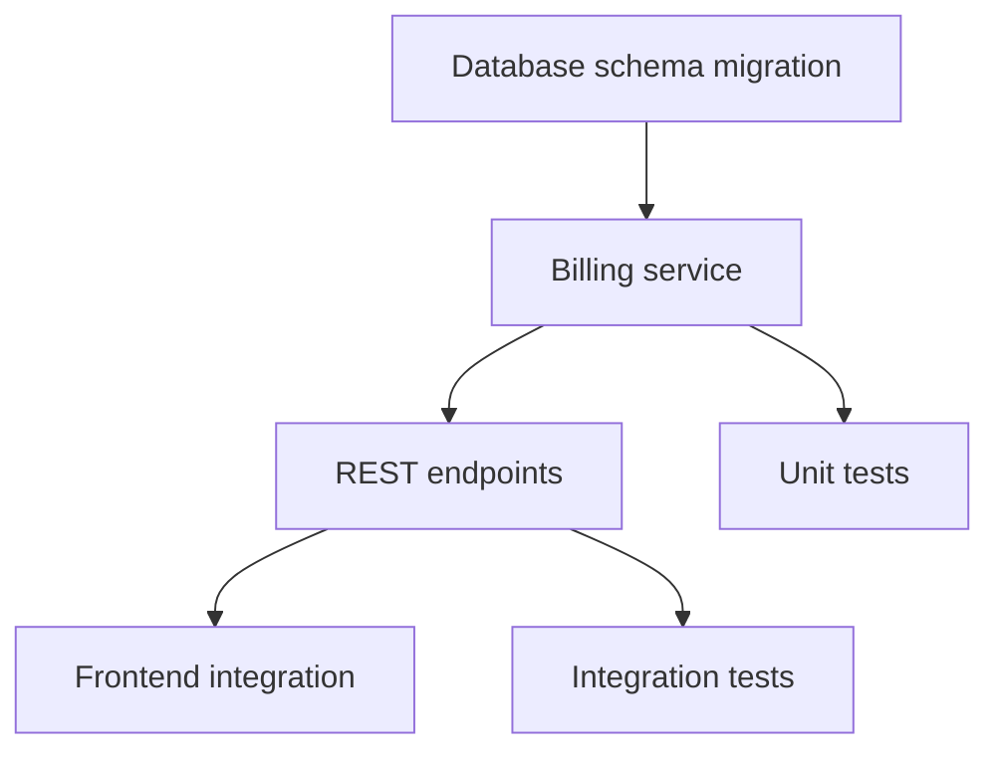
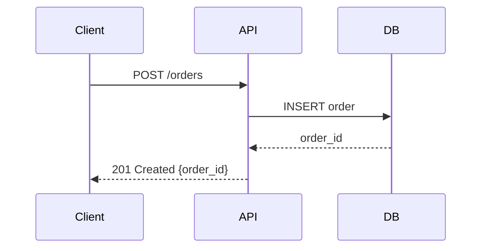

# Document Creation

Good documentation is a force multiplier. A well-written spec prevents weeks of wasted work. A clear ADR saves future engineers from repeating past mistakes. This skill covers the templates and practices for creating effective technical documents.

---

## 1. Spec Template

Use this template when proposing a new feature or significant change. Specs are the primary input for planning and task breakdown.

```markdown
# [Feature Name] — Spec

## Status
Draft | In Review | Approved | Superseded by [link]

## Problem Statement
What problem are we solving? Who experiences it? How painful is it?
Include data if available (error rates, support tickets, user feedback).

## Proposed Solution
Describe the solution at a level of detail appropriate for the audience.
Include:
- High-level architecture (use mermaid diagrams)
- Key data models or schema changes
- API surface changes
- User-facing behavior changes

## Alternatives Considered
| Alternative | Pros | Cons | Why Not |
|-------------|------|------|---------|
| Option A    |      |      |         |
| Option B    |      |      |         |

## Success Criteria
How will we know this worked? Be specific and measurable.
- [ ] Criterion 1 (e.g., "P95 latency < 200ms")
- [ ] Criterion 2 (e.g., "Zero data loss during migration")
- [ ] Criterion 3 (e.g., "Support tickets for X drop by 50%")

## Scope and Non-Goals
**In scope:**
- Item 1
- Item 2

**Non-goals (explicitly out of scope):**
- Item 1 — why it's excluded
- Item 2 — why it's excluded

## Dependencies
- External service X (team contact: @person)
- Migration of table Y must complete first

## Open Questions
- [ ] Question 1 — who owns answering this?
- [ ] Question 2 — deadline for decision?

## Timeline
| Phase     | Duration | Description          |
|-----------|----------|----------------------|
| Phase 1   | 1 week   | Core implementation  |
| Phase 2   | 3 days   | Testing & hardening  |
| Phase 3   | 2 days   | Rollout              |
```

---

## 2. ADR Template (Architecture Decision Record)

Use ADRs to document significant technical decisions. "Significant" means: it would be hard to reverse, it affects multiple components, or future engineers will ask "why did we do it this way?"

```markdown
# ADR-[NUMBER]: [Title]

## Date
YYYY-MM-DD

## Status
Proposed | Accepted | Deprecated | Superseded by ADR-XXX

## Context
What is the technical or business situation that requires a decision?
What constraints exist? What forces are at play?

## Decision
State the decision clearly and concisely.
"We will use [X] for [Y] because [Z]."

## Consequences

### Positive
- Benefit 1
- Benefit 2

### Negative
- Tradeoff 1 — mitigation strategy
- Tradeoff 2 — accepted risk

### Neutral
- Side effect that is neither good nor bad

## Alternatives Considered

### Alternative 1: [Name]
Description, pros, cons, and why it was rejected.

### Alternative 2: [Name]
Description, pros, cons, and why it was rejected.

## References
- Link to spec, discussion thread, or external resource
```

### ADR Naming Convention

Store ADRs in `docs/adr/` with filenames like `0001-use-postgres-for-primary-storage.md`. Number them sequentially. Never reuse a number, even if an ADR is deprecated.

---

## 3. Implementation Plan Template

Use this after a spec is approved. The implementation plan is the bridge between "what" and "how" — it describes the exact file-level changes needed.

```markdown
# Implementation Plan: [Feature Name]

## Reference
- Spec: [link]
- Task: [task ID]

## Overview
One paragraph summarizing the approach.

## File-Level Changes

### New Files
| File Path | Purpose |
|-----------|---------|
| `src/services/billing.ts` | Billing calculation service |
| `src/routes/billing.ts` | REST endpoints for billing |

### Modified Files
| File Path | Change Description |
|-----------|--------------------|
| `src/db/schema.ts` | Add `invoices` table |
| `src/routes/index.ts` | Register billing routes |

### Deleted Files
| File Path | Reason |
|-----------|--------|
| `src/legacy/old-billing.ts` | Replaced by new service |

## Dependencies and Order



## Database Changes

```sql
-- Migration: add_invoices_table
CREATE TABLE invoices (
  id UUID PRIMARY KEY DEFAULT gen_random_uuid(),
  user_id UUID NOT NULL REFERENCES users(id),
  amount_cents INTEGER NOT NULL,
  status TEXT NOT NULL DEFAULT 'pending',
  created_at TIMESTAMPTZ NOT NULL DEFAULT now()
);

CREATE INDEX idx_invoices_user_id ON invoices(user_id);
```

## Test Strategy
- Unit tests for billing calculation edge cases
- Integration tests for the full billing flow
- Manual QA checklist: [link]

## Rollout Plan
1. Deploy with feature flag `billing-v2` disabled
2. Enable for internal users
3. Enable for 10% of users, monitor for 24h
4. Full rollout

## Rollback Plan
Disable feature flag. No data migration rollback needed — new tables are additive.
```

---

## 4. Best Practices

### Structure and Flow

- **Start with "why" before "what."** Every document should open with the problem or context. A reader who doesn't understand the problem can't evaluate the solution.
- **Use progressive disclosure.** Lead with a summary, then add detail. Busy readers should get value from the first two paragraphs alone.
- **One idea per section.** If a section covers two things, split it.

### Diagrams

Use mermaid diagrams for architecture and flow. They render in most markdown viewers and are version-controllable.



Keep diagrams simple. If a diagram needs more than 15 nodes, split it into multiple diagrams showing different aspects.

### References and Linking

- Link to related tasks by ID (e.g., `QUE-123`).
- Link to related specs and ADRs.
- Link to external resources (RFCs, library docs) with context — don't just drop a URL.

### Length and Focus

- **Specs:** 500-1500 words. If longer, the scope is probably too big — split the feature.
- **ADRs:** 200-500 words. Be concise; the decision is the core.
- **Implementation plans:** As long as needed, but no longer. File-level change tables can be long for big features.
- **General rule:** If you can't explain it in under 2000 words, you don't understand it well enough yet.

### Acceptance Criteria

Always write acceptance criteria as a checklist. Each item should be independently testable.

Bad:
> The billing system works correctly.

Good:
- [ ] Users can view their invoice history on `/billing`
- [ ] Invoices are generated on the 1st of each month at 00:00 UTC
- [ ] Failed payments retry 3 times with exponential backoff
- [ ] Admin users can manually trigger invoice generation

### Review Process

1. Write the draft.
2. Let it sit for at least 1 hour before re-reading (if time permits).
3. Ask: "Could someone implement this without asking me questions?"
4. Share for review. Tag specific reviewers for specific sections.
5. Address feedback and mark the document as Approved.

### Common Mistakes

| Mistake | Fix |
|---------|-----|
| Writing the solution before defining the problem | Always start with Problem Statement |
| Skipping alternatives | Forces you to justify your choice |
| No success criteria | You can't declare victory without a finish line |
| Too much detail in specs | Save implementation details for the plan |
| No open questions section | Be honest about what you don't know yet |
